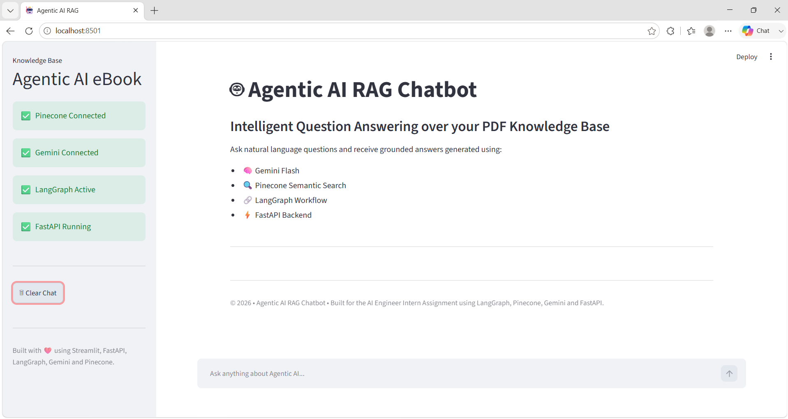
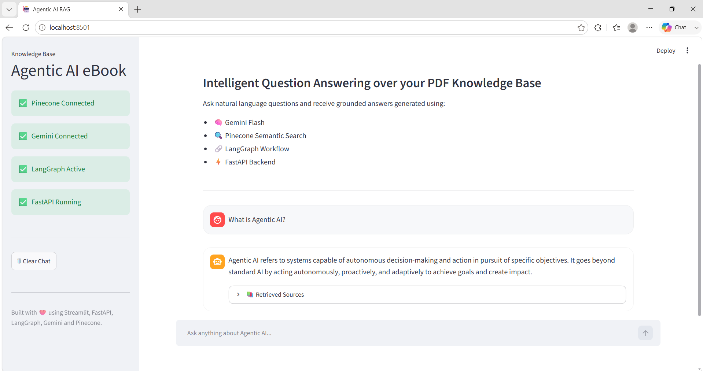
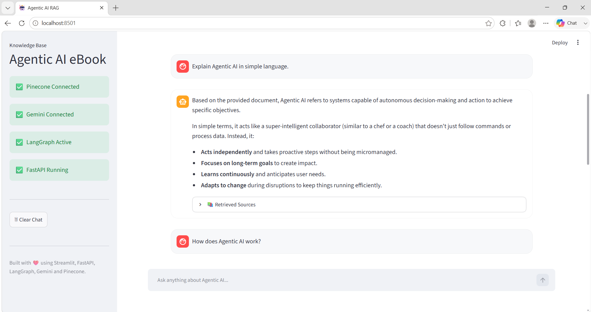
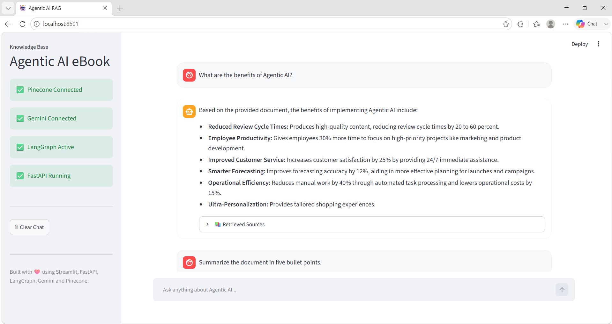
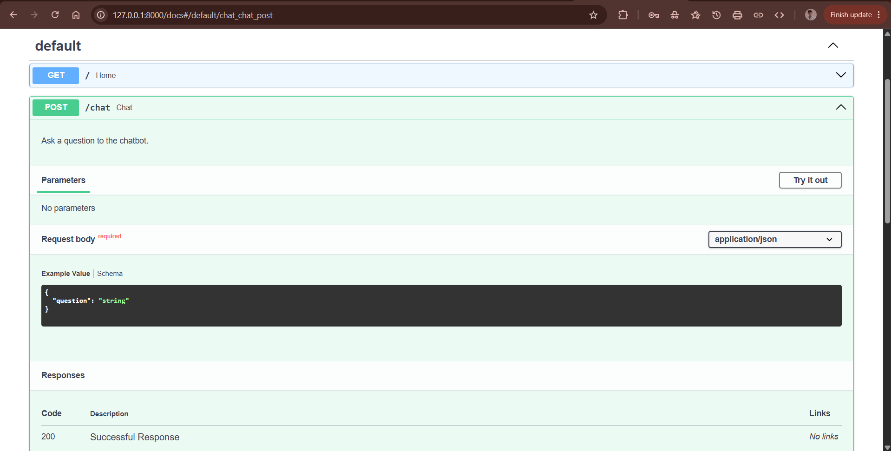

# 🤖 Agentic AI RAG Chatbot

A production-ready Retrieval-Augmented Generation (RAG) chatbot that combines semantic search, vector databases, and Large Language Models to deliver grounded answers from a custom knowledge base.


The chatbot answers questions **strictly from the provided Agentic AI eBook** by retrieving semantically relevant document chunks from Pinecone before generating grounded responses with Gemini Flash.

---

# ✨ Features

- 📄 PDF Knowledge Base
- ✂️ Intelligent Text Chunking
- 🧠 Gemini Embeddings
- 🔍 Pinecone Vector Search
- 🔗 LangGraph Workflow
- 🤖 Gemini Flash LLM
- ⚡ FastAPI REST API
- 🎨 Modern Streamlit Chat Interface
- 📚 Retrieved Context Sources
- 📈 Similarity Confidence Scores
- 💬 Multi-turn Conversation Support

---

# 🌟 Project Highlights

- ✅ End-to-end RAG Pipeline
- ✅ Google Gemini + Pinecone Integration
- ✅ LangGraph Workflow Orchestration
- ✅ FastAPI REST API
- ✅ Interactive Streamlit Interface
- ✅ Cloud Deployed (Render + Streamlit Community Cloud)
- ✅ MIT Licensed

---

### 🌐 Streamlit Application

👉 https://agentic-ai-rag-chatbot133.streamlit.app

### ⚡ FastAPI API

👉 https://agentic-ai-rag-chatbot-vz1l.onrender.com

### 📚 Swagger Documentation

👉 https://agentic-ai-rag-chatbot-vz1l.onrender.com/docs

---

# 🏗 Project Architecture

```text
                   PDF
                    │
                    ▼
          Text Extraction
                    │
                    ▼
             Text Chunking
                    │
                    ▼
        Gemini Embeddings
                    │
                    ▼
        Pinecone Vector DB
                    │
                    ▼
             User Question
                    │
                    ▼
         Query Embedding
                    │
                    ▼
       Semantic Retrieval
                    │
                    ▼
      Retrieved Context Chunks
                    │
                    ▼
          LangGraph Workflow
                    │
                    ▼
            Gemini Flash LLM
                    │
                    ▼
            Grounded Answer
                    │
                    ▼
       FastAPI → Streamlit UI
```

---

# 🛠 Tech Stack

| Technology | Purpose |
|------------|---------|
| Python | Programming Language |
| LangGraph | RAG Workflow Orchestration |
| LangChain | LLM Integration |
| Google Gemini | Large Language Model |
| Gemini Embeddings | Text Embeddings |
| Pinecone | Vector Database |
| FastAPI | REST API Backend |
| Streamlit | Chat Interface |
| PyMuPDF | PDF Processing |

---

# 📂 Project Structure

```text
agentic-ai-rag-chatbot/
│
├── api/                 # FastAPI backend
├── config/              # Environment configuration
├── data/                # PDF knowledge base
├── ingest/              # PDF ingestion pipeline
├── rag/                 # LangGraph RAG workflow
├── screenshots/         # README screenshots
├── tests/               # Unit tests
├── ui/                  # Streamlit frontend
├── vectorstore/         # Pinecone integration
│
├── .env.example
├── .gitignore
├── pytest.ini
├── requirements.txt
└── README.md
```

---

# ⚙️ Installation

## 1. Clone the repository

```bash
git clone https://github.com/pratham133/agentic-ai-rag-chatbot.git

cd agentic-ai-rag-chatbot
```

---

## 2. Create a Virtual Environment

### Windows

```bash
python -m venv .venv

.venv\Scripts\activate
```

### Linux / macOS

```bash
python3 -m venv .venv

source .venv/bin/activate
```

---

## 3. Install Dependencies

```bash
pip install -r requirements.txt
```

---

## 4. Configure Environment Variables

Create a `.env` file in the project root.

```env
# Google Gemini API Key
GOOGLE_API_KEY=YOUR_GOOGLE_API_KEY

# Pinecone API Key
PINECONE_API_KEY=YOUR_PINECONE_API_KEY

# Pinecone Index
PINECONE_INDEX_NAME=agentic-ai-rag

# Gemini Chat Model
CHAT_MODEL=gemini-flash-latest

# Gemini Embedding Model
EMBEDDING_MODEL=gemini-embedding-2-preview

# Number of retrieved chunks
TOP_K=4
```

---

# 🚀 Running the Project

## Step 1 — Ingest the PDF

```bash
python ingest/main.py
```

This process:

- Reads the PDF
- Splits it into chunks
- Generates Gemini embeddings
- Stores vectors inside Pinecone

---

## Step 2 — Start FastAPI

```bash
uvicorn api.main:app --reload
```

FastAPI runs at:

```
http://127.0.0.1:8000
```

Swagger Documentation:

```
http://127.0.0.1:8000/docs
```

---

## Step 3 — Start Streamlit

```bash
streamlit run ui/app.py
```

Open:

```
http://localhost:8501
```

---

# 📡 API Endpoint

## POST `/chat`

Request

```json
{
  "question": "What is Agentic AI?"
}
```

Example Response

```json
{
  "question": "What is Agentic AI?",
  "answer": "...",
  "contexts": [
    {
      "page": 17,
      "score": 0.817,
      "text": "..."
    }
  ]
}
```

Every response contains:

- Generated answer
- Retrieved context chunks
- Similarity scores

This satisfies the assignment requirement of returning supporting evidence alongside the generated answer.

---

# 📸 Application Screenshots

## 🏠 Home Page



---

## 💬 Chat Example



---

## 💭 Multi-turn Conversation (Part 1)



---

## 💭 Multi-turn Conversation (Part 2)



---

## ⚡ FastAPI Documentation



---

# 💬 Sample Queries

- What is Agentic AI?
- Explain Agentic AI in simple language.
- How does Agentic AI work?
- What are the benefits of Agentic AI?
- Summarize the document in five bullet points.
- How is Agentic AI different from traditional AI?

---

# 🏗 Architecture Explanation

The chatbot follows a Retrieval-Augmented Generation (RAG) workflow.

1. The Agentic AI eBook is ingested and divided into semantic chunks.
2. Gemini Embeddings convert every chunk into vector representations.
3. Pinecone stores the vectors for semantic similarity search.
4. User questions are embedded using the same embedding model.
5. Pinecone retrieves the most relevant document chunks.
6. LangGraph orchestrates retrieval, prompt construction, and response generation.
7. Gemini Flash generates answers grounded only in the retrieved context.
8. FastAPI exposes the REST API while Streamlit provides the interactive chat interface.

This architecture significantly reduces hallucinations by grounding every response in the uploaded knowledge base.

---

# 🔗 Why LangGraph?

LangGraph is used to orchestrate the Retrieval-Augmented Generation workflow as a graph of modular nodes.

In this project it manages:

- Document Retrieval
- Prompt Construction
- Answer Generation

This modular architecture improves maintainability, readability, and makes it easy to extend the workflow with additional processing steps in the future.

---

# 🎯 Assignment Deliverables

This project satisfies all requirements of the AI Engineer Internship assignment.

- ✅ PDF ingestion and chunking
- ✅ Gemini text embeddings
- ✅ Pinecone vector database
- ✅ LangGraph workflow
- ✅ Grounded answer generation
- ✅ FastAPI REST API
- ✅ Streamlit Chat UI
- ✅ Retrieved context chunks
- ✅ Similarity confidence scores
- ✅ Sample queries
- ✅ Architecture explanation

---

# 🔮 Future Improvements

Potential future enhancements include:

- Conversation memory
- Multi-document support
- Source highlighting
- Streaming responses
- User authentication
- Docker containerization
- Multi-user support
- Hybrid semantic + keyword retrieval
- Evaluation metrics for RAG quality

---

# 📄 License

This project is licensed under the MIT License.
See the LICENSE file for more information.

---

# 👨‍💻 Author

**Pratham Pasi**

AI & Python Developer

Building Intelligent Applications using LLMs, Retrieval-Augmented Generation (RAG), and Data Analytics.

GitHub: https://github.com/pratham133

---

# ⭐ Acknowledgements

This project was developed as part of the **AI Engineer Intern Technical Assessment** for **Appening Infotech**.

It demonstrates a production-style Retrieval-Augmented Generation (RAG) pipeline built using:

- Google Gemini
- LangGraph
- Pinecone
- FastAPI
- Streamlit
- LangChain

---

If you found this project useful, consider giving it a ⭐ on GitHub.